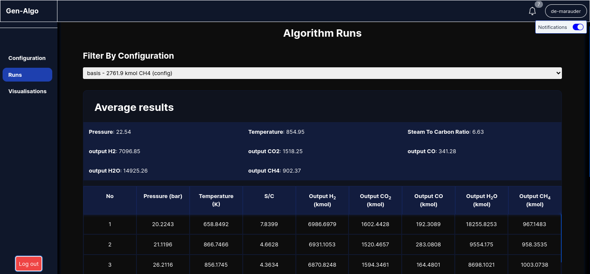

# Gen Algo WebUI

A [website](https://gen-algo-webui.vercel.app/) for interacting with a [genetic algorithm](http://github.com/de-marauder/genetics_algorithm) to optimize hydrogen production from flare gases using a Steam Methane Reformer (My Bachelors thesis). It makes use of an [API](http://github.com/de-marauder/gen-algo-api) to provide a user friendly interface for users to run the algorithm with mulltiple configurations and study the results using visually pleasing graphs.

## How to use

### Sign up
First of all, you have to create a user account. We just need a username, email and password. Nothing much. After that, you'll be taken to your dashboard.

### Configurations
By default you have a config which you can create by navigating to https://gen-algo-webui.vercel.app/dashboard/config (This is of course after you've signed up). All you have to do is name it or not (an arbitrary name will be given if you don't). You can create multiple configurations perhaps depending on different flare samples or algorithm settings to study the behaviour with respect to those changes

 

### Runs
Using a particular configuration, you can make runs multiple times. When a run is done, you'll receive a notification (You need to subscribe to receive notifications first). 

You also get a nice table to view all your runs per configuration. A summary of their average values are prepared as well.

### Visualizations
You view graphs that map the way the results of the algorithm changes with successive runs. This can help you gain an idea of the algorithms performance and suitability of the results obtained. You can also easily compare them with graphs from the results obtained with other configurations by simply toggling between different configs.

## Technologies
- Website was built with NextJs 13. It makes use of the App Router
- Notifications are handled with FCM (firebase Cloud Messaging)
- Graphs are plotted using d3.js
